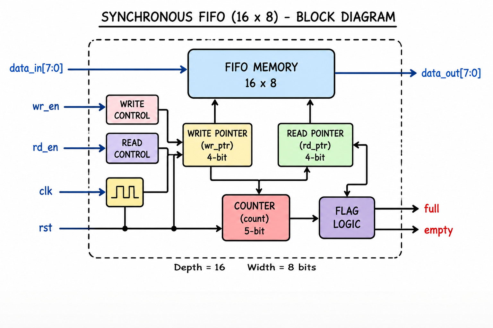
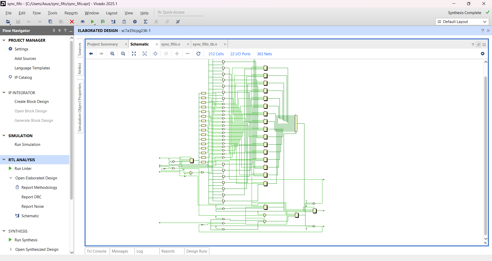
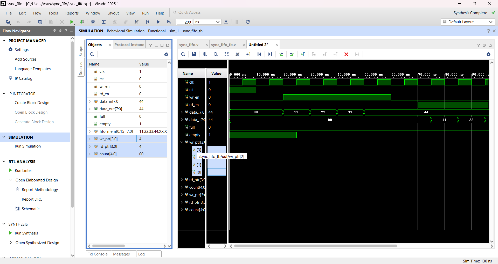

# Synchronous FIFO Verilog

Design and Verification of a 16x8 Synchronous FIFO using Verilog HDL and Vivado Simulator.

## Features

* 16-depth FIFO memory
* 8-bit data width
* Synchronous read and write operations
* Full flag generation
* Empty flag generation
* Verilog testbench verification

## Block Diagram

## RTL Schematic

## Simulation Waveform

## Project Files

* sync_fifo.v – FIFO Design
* sync_fifo_tb.v – Testbench
* sync_fifo.png – Block Diagram
* rtl_schematic.png – RTL Schematic
* waveform.png – Simulation Result

## Tools Used

* Verilog HDL
* Xilinx Vivado 2025.1

## Author

Sahil Abbas

